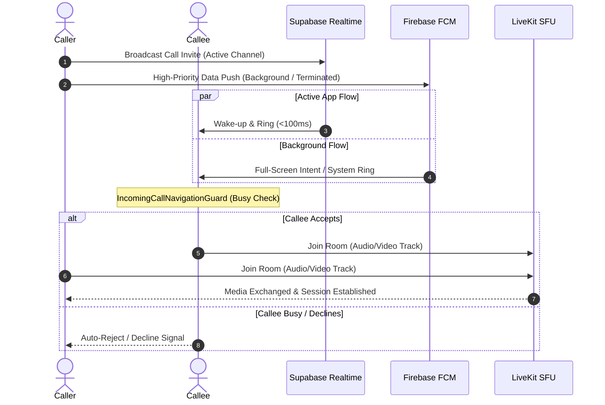

<!-- ═══════════════════════════════════════════════════════════════════════
     SOCIAL MATE — README
     Asset placeholders (replace by dropping files at these paths):
       https://github.com/user-attachments/assets/7bc99b0a-d3a0-4a76-af2e-1485aac8200a                  → widescreen hero banner
       https://github.com/user-attachments/assets/dc5fba14-e08b-4408-9e8b-0a24512c14b2                    → circular app logo
       docs/assets/screenshots/*.png           → frameless, high-DPI UI captures
     ═══════════════════════════════════════════════════════════════════════ -->

<p align="center">
  
</p>

<h1 align="center">
  
  Social Mate
</h1>

<p align="center">
  <b>A production-grade, real-time social platform built with Flutter.</b><br/>
  Chat · Group & WebRTC Calls · Stories · Reels · Multi-Model AI · Offline-First
</p>

<!-- Tier 1 — Core Stack -->
<p align="center">
  
  
  
  
  
  
  
  
</p>

<!-- Tier 2 — Engineering Metrics -->
<p align="center">
  
  
  
  
  
  
  
</p>

<!-- Quick Navigation -->
<p align="center">
  <a href="#-overview"><b>[ 📖 Overview ]</b></a> ·
  <a href="#-showcase"><b>[ 📸 Showcase ]</b></a> ·
  <a href="#-features"><b>[ ✨ Features ]</b></a> ·
  <a href="#%EF%B8%8F-architecture"><b>[ 🏗️ Architecture ]</b></a> ·
  <a href="#-calls-engine"><b>[ 📞 Calls Engine ]</b></a> ·
  <a href="#-ai-gateway"><b>[ 🤖 AI Gateway ]</b></a> ·
  <a href="#%EF%B8%8F-tech-stack"><b>[ 🛠️ Tech Stack ]</b></a> ·
  <a href="#-getting-started"><b>[ 🚀 Getting Started ]</b></a> ·
  <a href="#%EF%B8%8F-roadmap"><b>[ 🗺️ Roadmap ]</b></a>
</p>

---

## 📖 Overview

**Social Mate** is a full-featured social platform that combines the best of a social feed, a messenger, a short-video app, and an AI assistant in a single Flutter codebase. It is engineered around three principles:

| Principle | What it means in practice |
| --- | --- |
| **Real-time by default** | Supabase Realtime for chat, presence, and posts; LiveKit SFU for audio/video; dual-path call signaling. |
| **Resilient & offline-first** | Hive-backed local snapshots render chats, groups, and posts instantly, even without a connection. |
| **Modular & maintainable** | Feature-first clean architecture: **26 self-contained modules** on top of a shared `core/` layer. |

---

## 📸 Showcase

> All captures are **frameless, high-DPI, rounded-corner UI cards**.

### 🌱 Core Experience

<table align="center">
  <tr>
    <td align="center" width="33%">
      <br/>
      <sub><b>Authentication</b><br/>Password strength meter</sub>
    </td>
    <td align="center" width="33%">
      <br/>
      <sub><b>Home Feed</b><br/>Stories carousel &amp; posts</sub>
    </td>
    <td align="center" width="33%">
      <br/>
      <sub><b>Discover People</b><br/>Mutual friends &amp; connection cards</sub>
    </td>
  </tr>
</table>

### 💬 Real-Time Communication

<table align="center">
  <tr>
    <td align="center" width="33%">
      <br/>
      <sub><b>1-on-1 Chat</b><br/>Waveform voice notes &amp; stickers</sub>
    </td>
    <td align="center" width="33%">
      <br/>
      <sub><b>Group Chat</b><br/>Mentions &amp; shared media</sub>
    </td>
    <td align="center" width="33%">
      <br/>
      <sub><b>Call Message Bubbles</b><br/>Ongoing · Ended · Missed</sub>
    </td>
  </tr>
</table>

### 📞 Calling System (WebRTC)

<table align="center">
  <tr>
    <td align="center" width="33%">
      <br/>
      <sub><b>Incoming Call</b><br/>Lock-screen / ambient orbit</sub>
    </td>
    <td align="center" width="33%">
      <br/>
      <sub><b>Live Video Call</b><br/>Adaptive stage &amp; PiP overlay</sub>
    </td>
    <td align="center" width="33%">
      <br/>
      <sub><b>Members Ringing Sheet</b><br/>Ring offline members</sub>
    </td>
  </tr>
</table>

### 🎬 Multimedia & AI

<table align="center">
  <tr>
    <td align="center" width="33%">
      <br/>
      <sub><b>Reels</b><br/>Short-form vertical video</sub>
    </td>
    <td align="center" width="33%">
      <br/>
      <sub><b>AI Chat</b><br/>Multi-model streaming &amp; image prompt</sub>
    </td>
    <td align="center" width="33%">
      <br/>
      <sub><b>Sticker Studio</b><br/>Design &amp; share packs</sub>
    </td>
  </tr>
</table>

### 🎨 Customization & Security

<table align="center">
  <tr>
    <td align="center" width="33%">
      <br/>
      <sub><b>12+ Themes</b><br/>Ocean, Sunset, Midnight, Emerald…</sub>
    </td>
    <td align="center" width="33%">
      <br/>
      <sub><b>App Lock</b><br/>Biometric gate</sub>
    </td>
    <td align="center" width="33%">
      <br/>
      <sub><b>Notification Center</b><br/>Unified activity inbox</sub>
    </td>
  </tr>
</table>


## ✨ Features

Social Mate ships **26 modular features**, each a self-contained module under `lib/features/`.

| # | Feature | Highlights |
| :-: | --- | --- |
| 1 | **Authentication** | Supabase Auth, live password-strength meter |
| 2 | **Home Feed** | Real-time posts stream, post themes for text posts, full-screen media viewer |
| 3 | **Stories** | Gradient text, image & video stories, viewer sheet, reaction fountain, direct chat replies |
| 4 | **Reels** | Full-screen vertical player, video controller caching pool, interleaved home discovery rail |
| 5 | **Comments** | Nested threaded comments, voice comments, sheet & inline views |
| 6 | **Post Privacy** | Public · Friends Only · Private · Custom Audience |
| 7 | **Profile** | Profile view, pinned post, chronological posts, media stats |
| 8 | **Discover People** | Recommendations from mutual friends and mutual groups |
| 9 | **Connections** | Requests, accept/reject, follow/unfollow, friendship status tracking |
| 10 | **Blocked Users** | Dedicated management UI + server-level filtering |
| 11 | **1-on-1 Chat** | Real-time messaging, typing & recording presence, star/pin, forwarding |
| 12 | **Group Chat** | @mentions with live search, shared-media drawer, group management |
| 13 | **Attachment Sheet** | One sheet for images, videos, documents, audio, GIFs, stickers |
| 14 | **Voice Notes** | Chunked recording, compression, live waveform, slide-to-lock |
| 15 | **Reactions** | Animated emoji reactions with fountain effects |
| 16 | **Custom Sticker Studio** | Design and share public or private sticker packs |
| 17 | **Link Previews & Chat Search** | Smart link previews, search history |
| 18 | **1-on-1 Audio/Video Calls** | LiveKit-powered calls with dual signaling |
| 19 | **Group Calls** | Adaptive 1–8+ participant stage, active-speaker glow, targeted offline ringing |
| 20 | **Call Message Bubbles** | Durable Ongoing / Ended / Missed states via `GroupCallMessageContent` |
| 21 | **Standalone AI Chat** | Markdown, streaming typewriter, session drawer, quota tracking |
| 22 | **AI Writing Assistants** | Caption autocomplete (Arabic / English / Auto), comment & inline reply suggestions |
| 23 | **AI Chat Summarization** | Short, Detailed, By-Topic |
| 24 | **Notification Center** | Unified in-app inbox backed by FCM + Supabase |
| 25 | **Dynamic Theming** | 12+ themes with adaptive splash and logos |
| 26 | **Security** | Biometric app lock (`local_auth`) and two-factor authentication controls |

<details>
<summary><b>🧩 Deep dive: Real-Time Chat & Multimedia Messaging</b></summary>

<br/>

- **Unified Attachment Sheet:** a single bottom sheet for images, videos, documents, audio notes, GIFs, and stickers.
- **High-fidelity voice notes:** chunked recording, audio compression, live waveform rendering, slide-to-lock UX.
- **Rich messaging tools:** in-line @mentions with live suggestions, smart link previews, message forwarding, star/pin, search history, and a conversation shared-media drawer.
- **Reactions & stickers:** animated emoji reactions with fountain effects; the Sticker Studio lets users design and share public or private packs.

</details>

<details>
<summary><b>🎞️ Deep dive: Stories, Reels & Feed</b></summary>

<br/>

- **Stories:** gradient text stories, high-res image/video stories, interactive viewer sheet, reaction fountain, direct chat replies.
- **Reels:** full-screen swipeable player, video controller caching pool, interleaved home discovery rail, reels search tab.
- **Home feed:** real-time posts stream, post themes for text posts, full-screen media viewer, nested threaded comments with voice support.

</details>

<details>
<summary><b>🛡️ Deep dive: Social Graph, Discovery & Privacy</b></summary>

<br/>

- **Discover People:** recommendations based on mutual friends and mutual groups.
- **Connection lifecycle:** send, accept/reject, follow, unfollow, friendship status tracking.
- **Audience control:** per-post privacy (Public, Friends Only, Private, Custom Audience).
- **Blocked users:** dedicated UI plus server-level filtering.
- **Biometric security & 2FA:** app-wide biometric gate (`local_auth`) and two-factor controls.

</details>

<details>
<summary><b>🎨 Deep dive: Dynamic Theming Engine</b></summary>

<br/>

Twelve themes: **Ocean, Sunset, Midnight, Forest, Royal Gold, Ice Glass, Lavender, Carbon, Emerald, Nordic, Cyber Grape, Sahara.**
Each theme adapts primary colors, dark/light variants, splash animations, and the app logo.

</details>

---

## 🏗️ Architecture

### 1. Feature-First Clean Architecture

```text
lib/
├── core/                 # Cross-cutting: services, bootstrap, caching, routing, observability
└── features/             # 26 self-contained business modules
    └── <feature>/
        ├── cubit/        # State management (BLoC / Cubit)
        ├── service/      # Data access & business logic
        ├── model/        # Entities & DTOs
        ├── view/         # Screens
        └── widgets/      # Feature-local components
```

Strict separation: `core/` never depends on `features/`; features communicate via core abstractions.

### 2. Three-Phase Startup Bootstrap Pipeline

| Phase | Entry point | Responsibilities |
| :-: | --- | --- |
| **1** | `initializeCriticalBeforeRunApp()` | Orientation lock, foreground-task communication port, Crashlytics buffer attachment |
| **2** | `runApp(buildApp())` | Immediate UI mount with eager providers |
| **3** | `startCoreServicesBootstrap()` | Parallel init of Hive cache, Supabase SDK, SharedPreferences, ColdStart intent detection |

The UI mounts before slow services finish, which keeps cold start fast.

### 3. Offline-First & Cache Invalidation

- **`HiveCacheManager`** — in-flight future guards (no duplicate opens) and auto-recovery from corrupted boxes.
- **`LocalSnapshotStore`** — instant offline rendering of chats, groups, and posts, with a tenant-isolation guard (`_guardAgainstCrossAccountCacheLeak`) that prevents cross-account cache leakage.

### 4. Observability & Health Telemetry

- Centralized **`Observability`** facade that queues early crashes until Crashlytics is connected.
- Real-time diagnostics that detect **zombie Supabase Realtime channels** on session transitions.

---

## 📞 Calls Engine

A production-grade audio/video engine built on **LiveKit (WebRTC SFU)**.

| Capability | Implementation |
| --- | --- |
| **Low-latency media** | LiveKit SFU with dynacast and dynamic layer subscription |
| **Dual signaling** | Supabase Realtime broadcast for active instances (<100 ms wakeup) + Firebase FCM high-priority data push for background/terminated states |
| **Cross-isolate collision prevention** | `IncomingCallNavigationGuard` backed by `SharedPreferences` mirrors busy state across main and background isolates; `_autoRejectWhileBusy` rejects new calls without ringing or disrupting the active one |
| **Android foreground service** | `flutter_foreground_task` keeps socket and WebRTC audio stable in background; tapping the ongoing notification returns to the live call |
| **Picture-in-Picture** | Floating minimized call window for in-app browsing during calls |
| **Dynamic group grid** | Adaptive stage for 1–8+ participants (auto-scroll beyond 8), active-speaker glow (`Colors.greenAccent`) |
| **Targeted offline ringing** | Ring specific members who haven't joined, with fail-open busy verification |

### Durable Call Message Bubbles

Rendered through `GroupCallMessageContent` so state stays synchronized across devices:

| State | Behavior |
| --- | --- |
| 🟢 **Ongoing** | Real-time live indicator and **Tap to Join** |
| 🔴 **Ended** | Verified, non-zero duration (`⏱ mm:ss`); immune to false `00:00` |
| 🔴 **Missed** | Timed-out or cancelled calls show **Missed call** for recipients and **Ended call** for the initiator |

### Call Signaling Flow



---

## 🤖 AI Gateway

A multi-provider backend (Supabase Edge Function) with runtime provider switching.

- **Providers:** Google Gemini · Groq · OpenRouter, switchable at runtime.
- **Multimodal:** image + text input with automatic vision-capability detection per selected model.
- **Quota tracking:** usage surfaced to the client as `AiUsageSnapshot`.

### In-App AI Experiences

| Experience | Details |
| --- | --- |
| **Caption autocomplete** | Configurable language: Arabic, English, or Auto |
| **Comment & inline reply suggestions** | Tone and length personalization |
| **Chat summarization** | Short, Detailed, By-Topic |
| **Standalone AI Chat** | Markdown rendering, streaming typewriter animation, persistent session drawer, quota tracking |

---

## 🛠️ Tech Stack

| Layer | Technology |
| --- | --- |
| **Framework** | Flutter 3.x · Dart 3.x |
| **State management** | BLoC / Cubit |
| **Backend** | Supabase (Postgres, Realtime, Auth, Storage, Edge Functions) |
| **Push & crash reporting** | Firebase Cloud Messaging · Crashlytics |
| **Real-time media** | LiveKit (WebRTC SFU) |
| **AI** | Gemini · Groq · OpenRouter via Edge Function gateway |
| **Media CDN** | Cloudinary |
| **Local storage** | Hive · SharedPreferences |
| **Security** | `local_auth` biometrics, 2FA |
| **Background work** | `flutter_foreground_task` |

---

## 🚀 Getting Started

### Prerequisites

| Requirement | Version / Notes |
| --- | --- |
| Flutter SDK | 3.x (stable) |
| Android | SDK 21+ (foreground service features target Android 14+) |
| iOS | 14+ |
| Supabase project | Auth, Realtime, Storage, Edge Functions enabled |
| Firebase project | FCM + Crashlytics |
| LiveKit Cloud | Project URL, API key & secret |
| Cloudinary account | Cloud name & upload preset |

### Environment Reference

Configure via `.env` / `app_secrets.dart` (never commit real values):

| Key | Description |
| --- | --- |
| `SUPABASE_URL` | Your Supabase project URL |
| `SUPABASE_ANON_KEY` | Public anon key for client access |
| `LIVEKIT_URL` | LiveKit server WebSocket URL |
| `LIVEKIT_API_KEY` / `LIVEKIT_API_SECRET` | Used server-side to mint call tokens (never ship the secret in the client) |
| `CLOUDINARY_CLOUD_NAME` | Cloudinary cloud identifier |
| `CLOUDINARY_UPLOAD_PRESET` | Unsigned upload preset for media |
| `GEMINI_API_KEY` / `GROQ_API_KEY` / `OPENROUTER_API_KEY` | AI provider keys, set as Edge Function secrets |

> 🔐 Adjust key names to match your `app_secrets.dart` exactly.

### Setup Steps

**1. Clone the repository**

```bash
git clone https://github.com/Ahmedatef5O5/Social-Media-App.git
cd Social-Media-App
```

**2. Install dependencies**

```bash
flutter pub get
```

**3. Configure Firebase**

Place `google-services.json` in `android/app/` (and `GoogleService-Info.plist` in `ios/Runner/` for iOS).

**4. Set up Supabase**

Apply the SQL migrations, then deploy the Edge Functions:

```bash
supabase db push
supabase functions deploy send-notification
supabase functions deploy ai-gateway
```

**5. Add secrets**

Fill in `.env` / `app_secrets.dart` using the table above.

**6. Run or build**

```bash
flutter run
flutter build apk --release
flutter build appbundle --release
flutter build ios --release
```

---

## 🗺️ Roadmap

- [x] 26 core feature modules
- [x] LiveKit calling engine with dual signaling and foreground service
- [x] Multi-provider AI gateway
- [x] Offline-first snapshot cache with tenant isolation
- [ ] Expanded automated test coverage
- [ ] Additional AI assistants and model options
- [ ] More themes and sticker pack discovery

---

<p align="center">
  Made with ❤️ using Flutter · <b>Social Mate</b> — Connect · Share · Discover · Belong
</p>
